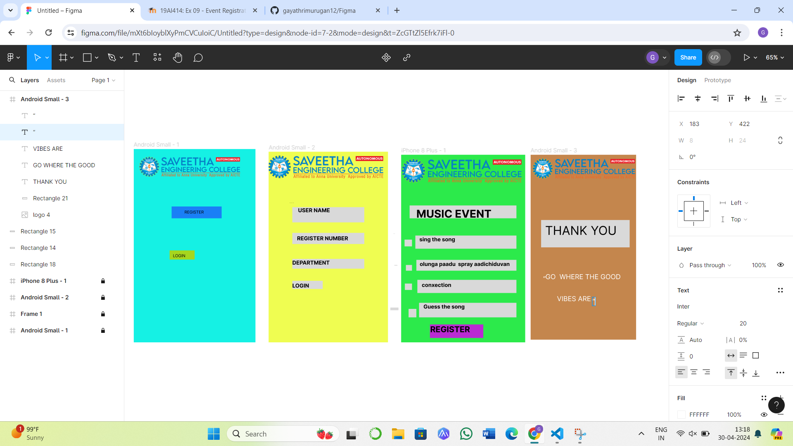

# Ex09 Event Registration Web Application
## Date:30.04.2024

## AIM:
To design, develop and deploy a web application for event registration.

## DESIGN STEPS:

### Step 1:
Create a new frame.

### Step 2:
Select any one preset size of your choice.

### Step 3:
Select the shapes you need.

### Step 4:
Import images as needed.

### Step 5:
Create pages based on your need and link them.

### Step 6:

Validate the HTML and CSS code.

### Step 6:

Publish the website in the given URL.

## DESIGN TOOL:
Figma
## program:
```
Android small1
<div style="width: 360px; height: 572px; position: relative; background: #15F1E4">
  
  <div style="width: 148px; height: 35px; left: 112px; top: 170px; position: absolute; background: #1A7FF6"></div>
  <div style="width: 74px; height: 27px; left: 106px; top: 300px; position: absolute; background: #A6D61E"></div>
  <div style="width: 145px; height: 26px; left: 150px; top: 179px; position: absolute; color: black; font-size: 12px; font-family: Inter; font-weight: 400; word-wrap: break-word">REGISTER<br/></div>
  <div style="width: 140px; height: 33px; left: 116px; top: 308px; position: absolute; color: black; font-size: 12px; font-family: Inter; font-weight: 400; word-wrap: break-word">LOGIN</div>
</div>

Android small2
<div style="width: 353px; height: 564px; position: relative; background: #EFFD51">
  
  <div style="width: 213px; height: 45px; left: 70px; top: 164px; position: absolute; background: #D9D9D9"></div>
  <div style="width: 196px; height: 45px; left: 87px; top: 164px; position: absolute; color: black; font-size: 16px; font-family: Inter; font-weight: 700; word-wrap: break-word">USER NAME</div>
  <div style="width: 213px; height: 33px; left: 70px; top: 240px; position: absolute; background: #D9D9D9"></div>
  <div style="width: 191px; height: 26px; left: 84px; top: 247px; position: absolute; color: black; font-size: 16px; font-family: Inter; font-weight: 700; word-wrap: break-word">REGISTER NUMBER</div>
  <div style="width: 213px; height: 29px; left: 70px; top: 317px; position: absolute; background: #D9D9D9"></div>
  <div style="width: 205px; height: 27px; left: 70px; top: 319px; position: absolute; color: black; font-size: 16px; font-family: Inter; font-weight: 700; word-wrap: break-word">DEPARTMENT</div>
  <div style="width: 90px; height: 24px; left: 70px; top: 382px; position: absolute; background: #D9D9D9"></div>
  <div style="width: 90px; height: 19px; left: 70px; top: 387px; position: absolute; color: black; font-size: 16px; font-family: Inter; font-weight: 700; word-wrap: break-word">LOGIN</div>
</div>

iphone 8 plus
<div style="width: 367px; height: 555px; position: relative; background: #2CEA4B">
  <div style="width: 1px; height: 8px; left: 57px; top: 224px; position: absolute"></div>
  <div style="width: 316px; height: 38px; left: 25px; top: 150px; position: absolute; background: #D9D9D9"></div>
  <div style="width: 299px; height: 39px; left: 42px; top: 239px; position: absolute; background: #D9D9D9"></div>
  
  <div style="width: 263px; height: 33px; left: 45px; top: 155px; position: absolute; color: black; font-size: 32px; font-family: Inter; font-weight: 700; word-wrap: break-word">MUSIC EVENT</div>
  <div style="width: 262px; height: 30px; left: 54px; top: 241px; position: absolute; color: black; font-size: 16px; font-family: Inter; font-weight: 700; word-wrap: break-word">sing the song</div>
  <div style="width: 296px; height: 32px; left: 45px; top: 311px; position: absolute; background: #D9D9D9"></div>
  <div style="width: 272px; height: 29px; left: 55px; top: 314px; position: absolute; color: black; font-size: 16px; font-family: Inter; font-weight: 700; word-wrap: break-word">olunga paadu  spray aadichiduvan</div>
  <div style="width: 293px; height: 39px; left: 48px; top: 370px; position: absolute; background: #D9D9D9"></div>
  <div style="width: 266px; height: 33px; left: 61px; top: 376px; position: absolute; color: black; font-size: 16px; font-family: Inter; font-weight: 700; word-wrap: break-word">conxection</div>
  <div style="width: 1px; height: 1px; left: 60px; top: 452px; position: absolute; background: #D9D9D9"></div>
  <div style="width: 288px; height: 43px; left: 53px; top: 438px; position: absolute; background: #D9D9D9"></div>
  <div style="width: 261px; height: 30px; left: 66px; top: 440px; position: absolute; color: black; font-size: 16px; font-family: Inter; font-weight: 700; word-wrap: break-word">Guess the song</div>
  <div style="width: 22px; height: 20px; left: 10px; top: 251px; position: absolute; background: #D9D9D9"></div>
  <div style="width: 18px; height: 17px; left: 14px; top: 326px; position: absolute; background: #D9D9D9"></div>
  <div style="width: 21px; height: 19px; left: 11px; top: 381px; position: absolute; background: #D9D9D9"></div>
  <div style="width: 23px; height: 25px; left: 22px; top: 456px; position: absolute; background: #D9D9D9"></div>
  <div style="width: 158px; height: 40px; left: 85px; top: 502px; position: absolute; background: #BA2BD2"></div>
  <div style="width: 142px; height: 40px; left: 86px; top: 502px; position: absolute; color: black; font-size: 24px; font-family: Inter; font-weight: 700; word-wrap: break-word">REGISTER</div>
</div>

Android small 3
<div style="width: 312px; height: 547px; position: relative; background: #C4864D">
  
  <div style="width: 262px; height: 81px; left: 31px; top: 193px; position: absolute; background: #D9D9D9"></div>
  <div style="width: 237px; height: 61px; left: 43px; top: 202px; position: absolute; color: black; font-size: 36px; font-family: Inter; font-weight: 400; word-wrap: break-word">THANK YOU</div>
  <div style="left: 44px; top: 349px; position: absolute; color: white; font-size: 20px; font-family: Inter; font-weight: 400; word-wrap: break-word">GO  WHERE THE GOOD  </div>
  <div style="left: 78px; top: 414px; position: absolute; color: white; font-size: 20px; font-family: Inter; font-weight: 400; word-wrap: break-word">VIBES ARE</div>
  <div style="left: 183px; top: 422px; position: absolute; color: white; font-size: 20px; font-family: Inter; font-weight: 400; word-wrap: break-word">“</div>
  <div style="left: 37px; top: 355px; position: absolute; color: white; font-size: 20px; font-family: Inter; font-weight: 400; word-wrap: break-word">“</div>
</div>
```
## OUTPUT:


## RESULT:
The program to design, develop and deploy a web application for event registration is completed successfully.
